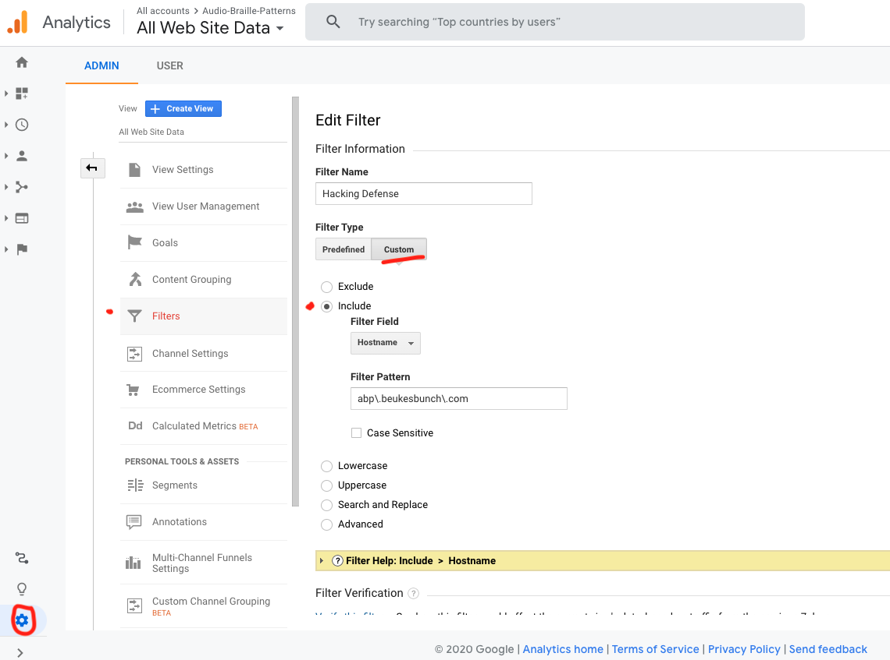

# Learning Journal

## Google Analytics
If you don't add a filter to your Google Analytics account, your development process will record analytics to your site too.

Another thing, someone could use your unique number (UA-xxxx-xxx-xxx) to generate false analytics.

See: [protect-analytics-from-hacking](https://neilpatel.com/blog/protect-analytics-from-hacking/)

Here is my setup for this site:
